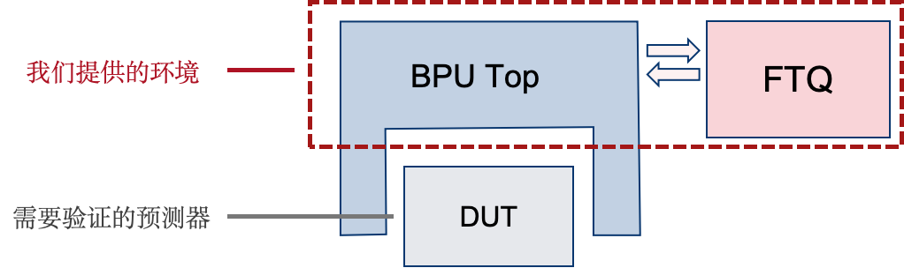

# uFTB-env

## 介绍

本项目提供了基于真实指令流的香山处理器 uFTB 分支预测器的仿真验证环境，以及时钟精确的 uFTB 参考模型，最终可给出 uFTB 的分支预测准确率。

为此，本项目为 uFTB 提供了简易的 BPU Top Wrapper，以向 uFTB 提供时序控制和输入输出处理。并向 BPU Top 提供了简易的 FTQ 实现，FTQ 中实例化了一个真实的程序仿真器，用于生成真实指令流，FTQ 会处理 BPU 产生的预测结果，并向 BPU 提供更新请求与重定向请求的执行反馈。大致的结构可参考下图。

对于香山 BPU 中其他子预测器的验证，可复用本项目中的真实指令执行环境，但需要对 DUT 的接口、时序以及需要使用的预测结果通道等进行适配。

## 快速使用

**安装 mlvp**

**生成 BRTParser Trace 工具**

为了生成真实的指令流，BRTParser 作为一个自定义的工具已经被放置在了本仓库中，但其中缺少了模拟器仿真程序，需要自行编译生成，具体步骤参见 https://github.com/yaozhicheng/NEMU

生成编译结果 `NemuBR` 后，将其放置在 `BRTParser` 目录下，工具即可正常使用。

**编译 DUT**

## 使用说明

